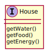
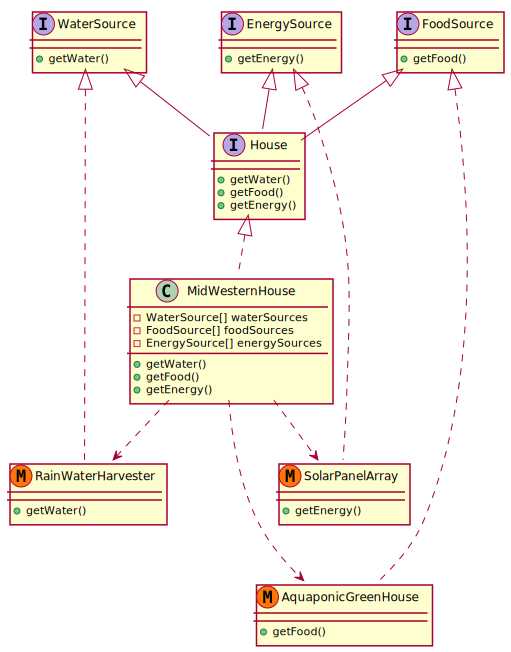

# House Resource Management Spec

* [Introduction](#introduction)
* [I/O](#i-o)
* [Introduction](#introduction)

## Introduction
Specification of a program to manage the resources of a house in a cyclical closed-loop system.

Sub-component of the [Ecovillage Resource Management Spec](./README.md).

House resources are defined as:

* Water
* Food
* Energy

Thus, a `House`, in the software can be thought of as a generic **interface** with the following methods:

* `getWater()`
* `getFood()`
* `getEnergy()`

You may have several implementations of this generic `House` interface to meet the needs of people in different bio-regions.

For example, a mid-western house.

**TODO:** In reality, a house would likely have *multiple* sources for any one resource. For example, energy may come from solar, wind, and bio-gas digestion. The above diagrams don't account for this yet. Expand this to `waterSources`, `foodSources`, and `energySources`?

## I/O
A house can be defined in terms of I/O, or **inputs** and **outputs**.

### Inputs
Inputs are unique to a geographic location or bio-region, and result in resource generation.

For example, in the mid-west of the United States, an input to a house may be **rain-water**.

The house would have a rain-water harvesting sub-component that adapts the **input** of rain-water to the **resource** of water.

Other geographic locations may have different inputs that lead to water resource generation such as ground-water, salt-water, river-water, glacier-water, or spring-water -- and each water input would need a different sub-component to adapt it to a water resource ready for human consumption.

### Outputs
* Human waste
* are there others?

## Principles
See [Village Resource Management Spec: Principles](./README.md#Principles).
